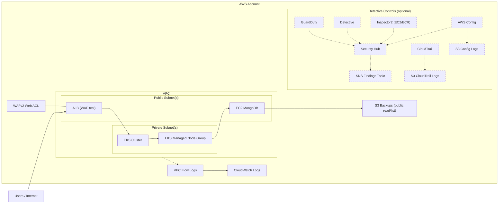

# Architecture Diagram (Terraform-Defined)

The diagram reflects the current Terraform-defined architecture. Optional detective controls are shown with dashed borders.

```mermaid
flowchart LR
  user["Users / Internet"]

  subgraph aws["AWS Account"]
    subgraph vpc["VPC"]
      subgraph public_subnet["Public Subnet(s)"]
        alb["ALB (WAF test)"]
        mongo["EC2 MongoDB"]
      end
      subgraph private_subnet["Private Subnet(s)"]
        eks["EKS Cluster"]
        nodes["EKS Managed Node Group"]
      end
    end

    waf["WAFv2 Web ACL"]
    s3backups["S3 Backups (public read/list)"]
    flowlogs["VPC Flow Logs"]
    cwlogs["CloudWatch Logs"]

    subgraph detective["Detective Controls (optional)"]
      guardduty["GuardDuty"]
      detective_graph["Detective"]
      securityhub["Security Hub"]
      inspector["Inspector2 (EC2/ECR)"]
      sns["SNS Findings Topic"]
      cloudtrail["CloudTrail"]
      s3trail["S3 CloudTrail Logs"]
      config["AWS Config"]
      s3config["S3 Config Logs"]
    end
  end

  user --> alb
  waf --- alb
  alb --> eks
  eks --> nodes
  nodes --> mongo
  mongo --> s3backups

  flowlogs --> cwlogs
  vpc -.-> flowlogs

  guardduty -.-> securityhub
  detective_graph -.-> securityhub
  inspector -.-> securityhub
  config -.-> securityhub
  securityhub -.-> sns

  cloudtrail -.-> s3trail
  config -.-> s3config

  classDef optional stroke-dasharray: 5 5;
  class guardduty,detective_graph,securityhub,inspector,sns,cloudtrail,s3trail,config,s3config optional;
```
