# Wiz Technical Exercise - Complete Implementation Guide

This guide demonstrates how this repository fulfills all requirements of the Wiz Technical Exercise assignment.

## Table of Contents
1. [Overview](#overview)
2. [Architecture](#architecture)
3. [Two-Tier Web Application](#two-tier-web-application)
4. [DevOps Implementation](#devops-implementation)
5. [Security Controls](#security-controls)
6. [Intentional Misconfigurations](#intentional-misconfigurations)
7. [Presentation Guide](#presentation-guide)
8. [Demo Checklist](#demo-checklist)

## Overview

This repository contains a complete implementation of the Wiz Technical Exercise, featuring:
- A containerized Node.js web application deployed on Amazon EKS
- A MongoDB database running on an intentionally misconfigured EC2 instance
- Automated infrastructure deployment using Terraform (IaC)
- CI/CD pipelines for infrastructure and application deployment
- Security scanning and monitoring tools
- Intentional security misconfigurations for CNAPP testing

## Architecture

### High-Level Architecture


### Network Architecture

```mermaid
graph TB
    subgraph Internet["Internet"]
        Users[Users]
        SSH[SSH Access]
    end
    
    subgraph VPC["VPC: 10.0.0.0/16"]
        IGW[Internet Gateway]
        
        subgraph AZ1["Availability Zone 1"]
            PublicSubnet1["Public Subnet<br/>10.0.1.0/24"]
            PrivateSubnet1["Private Subnet<br/>10.0.11.0/24"]
        end
        
        subgraph AZ2["Availability Zone 2"]
            PublicSubnet2["Public Subnet<br/>10.0.2.0/24"]
            PrivateSubnet2["Private Subnet<br/>10.0.12.0/24"]
        end
        
        subgraph Resources
            MongoVM["EC2 MongoDB<br/>Public IP"]
            ALB["Application Load Balancer"]
            EKS1["EKS Node Group 1"]
            EKS2["EKS Node Group 2"]
            NAT["NAT Gateway"]
        end
        
        subgraph SecurityGroups["Security Groups"]
            MongoSG["MongoDB SG<br/>- SSH: 0.0.0.0/0 ⚠️<br/>- MongoDB: VPC CIDR"]
            ALBSG["ALB SG<br/>- HTTP: 0.0.0.0/0<br/>- HTTPS: 0.0.0.0/0"]
            EKSSG["EKS Node SG<br/>- Internal traffic"]
        end
    end
    
    Users -->|HTTPS| IGW
    SSH -->|SSH:22 ⚠️| IGW
    IGW --> PublicSubnet1
    IGW --> PublicSubnet2
    PublicSubnet1 --> MongoVM
    PublicSubnet1 --> ALB
    PublicSubnet2 --> ALB
    PrivateSubnet1 --> EKS1
    PrivateSubnet2 --> EKS2
    
    MongoSG -.-> MongoVM
    ALBSG -.-> ALB
    EKSSG -.-> EKS1
    EKSSG -.-> EKS2
    
    EKS1 -.->|MongoDB:27017| MongoVM
    EKS2 -.->|MongoDB:27017| MongoVM
    
    PrivateSubnet1 --> NAT
    PrivateSubnet2 --> NAT
    NAT --> IGW
    
    style MongoVM fill:#ff6b6b
    style MongoSG fill:#ff6b6b
```



### Security Controls Architecture


### CI/CD Pipeline Architecture


## Two-Tier Web Application

### Application Component

**Technology Stack:**
- **Frontend/Backend**: Node.js Express application
- **Container**: Docker image built from `app/Dockerfile`
- **Orchestration**: Kubernetes (Amazon EKS)
- **Load Balancing**: NGINX Ingress Controller + AWS ALB
- **Container Registry**: Amazon ECR

**Key Features:**
- `/healthz` - Health check endpoint for Kubernetes probes
- `/items` - REST API to fetch items from MongoDB
- Environment-based MongoDB connection configuration
- Contains `wizexercise.txt` file with name embedded in image

**File Location:** `app/server.js`, `app/Dockerfile`, `app/deployment.yaml`

### Database Component

**Technology Stack:**
- **Database**: MongoDB 4.4 (outdated version - released 2020)
- **Operating System**: Debian 10 Buster (outdated - released 2019)
- **Hosting**: EC2 instance in public subnet
- **Access**: SSH publicly exposed, MongoDB restricted to VPC CIDR

**Intentional Misconfigurations:**
- ⚠️ SSH exposed to internet (port 22 from 0.0.0.0/0)
- ⚠️ Outdated Linux OS (Debian 10, 1+ year old)
- ⚠️ Outdated MongoDB version (4.4, 1+ year old)
- ⚠️ Overly permissive IAM permissions (can create VMs)
- ⚠️ Daily backups to publicly readable S3 bucket

**File Location:** `terraform/main.tf`, `terraform/mongo-vm/`

## DevOps Implementation

### Infrastructure as Code (IaC)

**Terraform Modules:**
- `terraform/main.tf` - Main infrastructure definition
- `terraform/vpc.tf` - VPC, subnets, networking
- `terraform/eks.tf` - EKS cluster configuration
- `terraform/mongo-vm/` - MongoDB EC2 instance
- `terraform/variables.tf` - Configurable parameters

**Resources Provisioned:**
- VPC with public and private subnets across 2 AZs
- EKS cluster with managed node groups
- EC2 instance running MongoDB
- S3 bucket for database backups (public read access)
- IAM roles and security groups
- CloudTrail, GuardDuty, Security Hub, Inspector, AWS Config
- Application Load Balancer with WAF

### CI/CD Pipelines

#### 1. Infrastructure Pipeline (`infra-ci.yml`)
**Triggers:** Push/PR to `terraform/**`

**Steps:**
1. Terraform format check (`terraform fmt`)
2. Terraform initialization (`terraform init`)
3. Terraform validation (`terraform validate`)
4. Checkov security scan
5. Yor resource tagging
6. Upload SARIF results to GitHub Security tab

**Security Controls:**
- IaC misconfigurations detected before deployment
- Results visible in GitHub Security dashboard
- Soft-fail mode allows deployment with warnings

#### 2. Application Pipeline (`app-deploy.yml`)
**Triggers:** Push to `app/**` or manual dispatch

**Steps:**
1. Configure AWS credentials (OIDC)
2. Build Docker image for linux/amd64
3. Scan image with Trivy
4. Push to Amazon ECR
5. Update EKS deployment
6. Wait for rollout completion

**Security Controls:**
- Container vulnerability scanning
- Immutable image tags
- Kubernetes health checks

#### 3. Infrastructure Deployment (`infra-deploy.yml`)
**Triggers:** Manual workflow dispatch

**Steps:**
1. Trigger Terraform Cloud run
2. Wait for completion (optional)
3. Apply infrastructure changes

**Benefits:**
- Centralized state management
- Remote execution
- Team collaboration

#### 4. Security Scanning (`security-scans.yml`)
**Triggers:** Weekly schedule + manual dispatch

**Steps:**
1. Scan ECR images with Trivy
2. Upload findings to GitHub Security
3. Track vulnerabilities over time

## Security Controls

### Detective Controls (Implemented)

#### 1. Amazon GuardDuty
- **Purpose:** Threat detection for AWS accounts and workloads
- **Coverage:** VPC Flow Logs, CloudTrail events, DNS logs
- **Configuration:** Enabled via `terraform/main.tf`
- **Findings:** Routed to Security Hub

#### 2. AWS Security Hub
- **Purpose:** Centralized security findings dashboard
- **Standards:** AWS Foundational Security Best Practices + CIS AWS Foundations Benchmark
- **Integrations:** GuardDuty, Inspector, AWS Config
- **Configuration:** `terraform/main.tf` lines 200-250
- **Alerts:** SNS topic for critical findings

#### 3. Amazon Inspector
- **Purpose:** Automated vulnerability management
- **Coverage:** EC2 instances and ECR container images
- **Scan Types:** Package vulnerabilities, network reachability
- **Configuration:** `terraform/main.tf` lines 300-320

#### 4. AWS CloudTrail
- **Purpose:** API audit logging
- **Coverage:** Multi-region trail with all management events
- **Features:** Log file validation enabled
- **Storage:** S3 bucket with encryption
- **Configuration:** `terraform/main.tf` lines 150-180

#### 5. AWS Config
- **Purpose:** Resource configuration tracking and compliance
- **Recording:** All supported resource types
- **Delivery:** S3 bucket + SNS notifications
- **Configuration:** `terraform/main.tf` lines 250-280

#### 6. Amazon Detective
- **Purpose:** Security investigation and analysis
- **Data Sources:** VPC Flow Logs, CloudTrail, GuardDuty
- **Configuration:** `terraform/main.tf` line 220

#### 7. VPC Flow Logs
- **Purpose:** Network traffic monitoring
- **Coverage:** All network interfaces in VPC
- **Storage:** CloudWatch Logs
- **Configuration:** `terraform/vpc.tf`

### Preventive Controls (Implemented)

#### 1. AWS WAF
- **Purpose:** Web application firewall
- **Rules:**
  - AWS Managed Rules - Core Rule Set (OWASP Top 10)
  - AWS Managed Rules - Known Bad Inputs
  - AWS Managed Rules - SQL Database Protection
  - Rate-based rule (2000 requests per 5 minutes)
- **Mode:** Count mode (for testing/demo)
- **Logging:** Enabled to CloudWatch
- **Configuration:** `terraform/main.tf` lines 400-500

#### 2. Security Groups
- **MongoDB SG:** SSH from specific IP, MongoDB from VPC CIDR only
- **ALB SG:** HTTP/HTTPS from internet
- **EKS Node SG:** Managed by EKS, allows internal cluster traffic
- **Configuration:** `terraform/main.tf`, `terraform/eks.tf`

#### 3. IAM Roles
- **EC2 Instance Role:** SSM access, overly permissive EC2 permissions (intentional)
- **EKS Node Role:** Managed policies for EKS, ECR, CloudWatch
- **Pod Service Account:** Cluster admin role (intentional misconfiguration)
- **Configuration:** `terraform/main.tf`, `app/rbac.yaml`

### CI/CD Security Controls

#### 1. Checkov
- **Purpose:** Static analysis for IaC misconfigurations
- **Coverage:** All Terraform files
- **Output:** SARIF format to GitHub Security
- **Configuration:** `.github/workflows/infra-ci.yml`

#### 2. Trivy
- **Purpose:** Container vulnerability scanning
- **Coverage:** All container images in ECR
- **Scan Types:** OS packages, application dependencies
- **Configuration:** `.github/workflows/security-scans.yml`

#### 3. GitHub Code Scanning
- **Purpose:** Security vulnerability detection in code
- **Integration:** SARIF uploads from Checkov and Trivy
- **Dashboard:** GitHub Security tab

#### 4. Terraform Validation
- **Purpose:** Syntax and configuration validation
- **Checks:** Format, initialization, validation
- **Configuration:** `.github/workflows/infra-ci.yml`

## Intentional Misconfigurations

This environment contains intentional security weaknesses for CNAPP demonstration purposes:

### 1. MongoDB VM Misconfigurations

#### a) SSH Exposed to Internet ⚠️
- **Issue:** Security group allows SSH (port 22) from 0.0.0.0/0
- **Risk:** Brute force attacks, unauthorized access
- **Detection:** Security Hub, GuardDuty
- **Location:** `terraform/main.tf` lines 40-46
- **Impact:** HIGH - Direct access to database server

#### b) Outdated Operating System ⚠️
- **Issue:** Debian 10 (Buster) - over 1 year old
- **Risk:** Unpatched vulnerabilities, compliance violations
- **Detection:** Inspector, Security Hub
- **Location:** `terraform/main.tf` lines 15-28
- **Impact:** HIGH - Known CVEs may be exploitable

#### c) Outdated MongoDB Version ⚠️
- **Issue:** MongoDB 4.4 (released July 2020, over 1+ years old)
- **Risk:** Unpatched database vulnerabilities
- **Detection:** Inspector
- **Impact:** HIGH - Database compromise possible

#### d) Overly Permissive IAM Role ⚠️
- **Issue:** EC2 instance can create VMs, describe instances
- **Risk:** Lateral movement, resource creation abuse
- **Detection:** AWS Config, Security Hub
- **Location:** `terraform/main.tf` IAM policy
- **Impact:** HIGH - Can spawn additional attack infrastructure

```json
{
  "Effect": "Allow",
  "Action": [
    "ec2:RunInstances",
    "ec2:DescribeInstances",
    "ec2:CreateTags"
  ],
  "Resource": "*"
}
```

### 2. S3 Bucket Misconfiguration

#### Public Read Access ⚠️
- **Issue:** S3 bucket allows public read and list
- **Risk:** Data exposure, compliance violations
- **Detection:** Security Hub, AWS Config
- **Location:** `terraform/main.tf` S3 bucket policy
- **Impact:** CRITICAL - Database backups publicly accessible

```json
{
  "Effect": "Allow",
  "Principal": "*",
  "Action": [
    "s3:GetObject",
    "s3:ListBucket"
  ],
  "Resource": [
    "arn:aws:s3:::bucket-name/*",
    "arn:aws:s3:::bucket-name"
  ]
}
```

**Consequences:**
- Database dumps downloadable by anyone
- Sensitive data exposure (PII, credentials)
- Compliance violations (GDPR, HIPAA, PCI-DSS)

### 3. Kubernetes Misconfigurations

#### a) Cluster Admin Role for Application Pod ⚠️
- **Issue:** Application service account has cluster-admin privileges
- **Risk:** Container escape, cluster takeover
- **Detection:** Manual review, third-party tools
- **Location:** `app/rbac.yaml`
- **Impact:** CRITICAL - Full cluster control from compromised pod

```yaml
apiVersion: rbac.authorization.k8s.io/v1
kind: ClusterRoleBinding
metadata:
  name: express-hello-admin
roleRef:
  apiGroup: rbac.authorization.k8s.io
  kind: ClusterRole
  name: cluster-admin  # ⚠️ TOO PERMISSIVE
subjects:
- kind: ServiceAccount
  name: express-hello-sa
  namespace: demo
```

**Attack Scenarios:**
1. Compromised container can create privileged pods
2. Can read all secrets in cluster
3. Can modify/delete any Kubernetes resource
4. Can escalate to node access

#### b) No Network Policies
- **Issue:** No network segmentation between pods
- **Risk:** Lateral movement within cluster
- **Detection:** Manual review
- **Impact:** MEDIUM - Compromised pod can access all pods

#### c) No Resource Limits
- **Issue:** Pods have no CPU/memory limits
- **Risk:** Resource exhaustion, DoS
- **Detection:** Manual review
- **Impact:** MEDIUM - Can impact cluster stability

### 4. Network Security Issues

#### a) Direct Internet Exposure
- **Issue:** MongoDB VM in public subnet with public IP
- **Risk:** Increased attack surface
- **Best Practice:** Place in private subnet, access via bastion
- **Impact:** MEDIUM - Combined with SSH exposure increases risk

### Summary of Findings

| # | Finding | Severity | CVSS | CWE | MITRE ATT&CK |
|---|---------|----------|------|-----|--------------|
| 1 | SSH exposed to 0.0.0.0/0 | HIGH | 7.5 | CWE-668 | T1133 External Remote Services |
| 2 | Outdated OS (Debian 10) | HIGH | 7.8 | CWE-1104 | T1068 Exploitation for Privilege Escalation |
| 3 | Outdated MongoDB 4.4 | HIGH | 8.1 | CWE-1104 | T1190 Exploit Public-Facing Application |
| 4 | Overly permissive IAM | HIGH | 7.2 | CWE-269 | T1078 Valid Accounts |
| 5 | Public S3 bucket | CRITICAL | 9.1 | CWE-284 | T1530 Data from Cloud Storage Object |
| 6 | Cluster-admin pod role | CRITICAL | 9.9 | CWE-250 | T1611 Escape to Host |
| 7 | No network policies | MEDIUM | 5.3 | CWE-923 | T1021 Remote Services |
| 8 | No resource limits | MEDIUM | 5.5 | CWE-400 | T1499 Endpoint Denial of Service |

## Presentation Guide

### Presentation Structure (45 minutes)

#### 1. Introduction (5 minutes)
- Brief background on CNAPP and cloud security
- Overview of the exercise objectives
- Technology choices (AWS, EKS, MongoDB, Terraform)

#### 2. Architecture Walkthrough (10 minutes)
- **Visual:** Show high-level architecture diagram
- Explain two-tier architecture (app + database)
- Network design (VPC, subnets, security groups)
- Why these specific technologies were chosen

#### 3. DevOps Implementation (10 minutes)
- **Visual:** Show CI/CD pipeline diagram
- Infrastructure as Code approach with Terraform
- CI/CD pipelines:
  - Infrastructure validation and deployment
  - Container build and deployment
  - Security scanning integration
- **Demo:** Show GitHub Actions workflows running
- **Demo:** Show Terraform Cloud workspace

#### 4. Security Controls (10 minutes)
- **Visual:** Show security controls diagram
- Detective controls:
  - GuardDuty findings
  - Security Hub dashboard
  - Inspector vulnerability reports
  - CloudTrail logs
- Preventive controls:
  - WAF rules and metrics
  - Security group configurations
  - IAM least privilege (where applied correctly)
- **Demo:** Live walkthrough of Security Hub
- **Demo:** Show CloudTrail events

#### 5. Intentional Misconfigurations (5 minutes)
- **Visual:** Highlight issues on architecture diagram
- Walk through each misconfiguration
- Explain potential consequences
- Show how each is detected
- Discuss remediation approaches

#### 6. Live Application Demo (5 minutes)
- **Demo:** Access application via load balancer URL
- **Demo:** Show application functionality
- **Demo:** Verify MongoDB connectivity
- **Demo:** Use kubectl to:
  - Show pods running
  - Exec into container
  - Verify wizexercise.txt exists
  - Demonstrate cluster-admin access (kubectl get secrets --all-namespaces)

### Demo Checklist

#### Pre-Demo Setup
- [ ] Ensure all infrastructure is deployed and healthy
- [ ] Verify application is accessible via load balancer
- [ ] Prepare browser tabs:
  - [ ] Load balancer URL
  - [ ] AWS Console - Security Hub
  - [ ] AWS Console - GuardDuty
  - [ ] AWS Console - Inspector
  - [ ] AWS Console - WAF
  - [ ] GitHub Actions workflows
  - [ ] Terraform Cloud workspace
- [ ] Prepare terminal sessions:
  - [ ] kubectl configured for EKS cluster
  - [ ] AWS CLI configured
  - [ ] Terraform directory ready
- [ ] Test all demos beforehand

#### Architecture Demo
- [ ] Show architecture diagrams
- [ ] Explain component relationships
- [ ] Highlight security boundaries
- [ ] Point out intentional misconfigurations

#### Infrastructure Demo
- [ ] Show Terraform code structure
- [ ] Explain key resources
- [ ] Show terraform state
- [ ] Demonstrate idempotency

#### CI/CD Demo
- [ ] Show GitHub repository structure
- [ ] Walk through workflow files
- [ ] Show successful pipeline run
- [ ] Show security scan results in GitHub Security tab
- [ ] Demonstrate SARIF integration

#### Application Demo
- [ ] Access application URL
- [ ] Show API response with MongoDB data
- [ ] Show health check endpoint
- [ ] Demonstrate application functionality

#### Kubernetes Demo
```bash
# Verify cluster access
kubectl cluster-info

# Show namespaces
kubectl get namespaces

# Show pods in demo namespace
kubectl get pods -n demo

# Show service account
kubectl get sa -n demo

# Show cluster role binding (overly permissive)
kubectl get clusterrolebinding express-hello-admin -o yaml

# Exec into pod
kubectl exec -it -n demo deploy/express-hello -- /bin/sh

# Inside pod - verify wizexercise.txt
cat /app/wizexercise.txt

# Inside pod - demonstrate cluster admin access
kubectl get secrets --all-namespaces | head -20

# Show this is a security risk!
```

#### MongoDB Demo
```bash
# Connect to EC2 instance (show SSH access)
ssh admin@<mongodb-public-ip>

# Show MongoDB running
sudo systemctl status mongodb

# Show MongoDB version (outdated)
mongod --version

# Show backup script
cat /usr/local/bin/backup-mongodb.sh

# Show S3 bucket contents
aws s3 ls s3://<bucket-name>/

# Show public access (dangerous!)
curl https://<bucket-name>.s3.amazonaws.com/
```

#### Security Controls Demo

**GuardDuty:**
- [ ] Show GuardDuty findings
- [ ] Filter by severity
- [ ] Explain finding types
- [ ] Show how findings integrate with Security Hub

**Security Hub:**
- [ ] Show Security Hub dashboard
- [ ] Show compliance score
- [ ] Review failed checks
- [ ] Show findings by severity
- [ ] Demonstrate SNS integration

**Inspector:**
- [ ] Show EC2 findings
- [ ] Show ECR findings
- [ ] Filter by CVE
- [ ] Show vulnerability details

**CloudTrail:**
- [ ] Show recent API calls
- [ ] Filter for specific events
- [ ] Demonstrate audit capability

**WAF:**
- [ ] Show WAF rules
- [ ] Show CloudWatch metrics
- [ ] Explain rate limiting
- [ ] Show OWASP Top 10 coverage

#### Misconfiguration Demo
- [ ] Show SSH security group rule
- [ ] Show S3 bucket policy (public access)
- [ ] Show overly permissive IAM role
- [ ] Show cluster-admin RBAC
- [ ] Explain impact of each
- [ ] Discuss remediation

### Talking Points

#### Approach and Methodology
- "I chose AWS because of familiarity and mature security services"
- "Used Terraform for reproducibility and version control"
- "Implemented GitOps approach with GitHub Actions"
- "Security scanning integrated into every pipeline"
- "Detective and preventive controls work together"

#### Challenges Faced
- "Balancing security requirements with intentional misconfigurations"
- "Ensuring MongoDB is accessible only from VPC CIDR while in public subnet"
- "Setting up OIDC authentication for GitHub Actions to AWS"
- "Managing Terraform state securely in Terraform Cloud"
- "Fine-tuning WAF rules to avoid false positives"

#### Solutions and Adaptations
- "Used terraform modules for reusability"
- "Implemented soft-fail for security scans to allow demo deployment"
- "Used SARIF format for consistent security reporting"
- "Automated everything to make environment reproducible"
- "Documented all misconfigurations clearly"

#### Security Insights
- "Security Hub provides excellent centralized visibility"
- "GuardDuty detected threats I didn't anticipate"
- "Inspector found vulnerabilities in outdated packages"
- "WAF in count mode lets us observe without blocking"
- "Combination of detective and preventive controls is essential"

### Questions to Anticipate

**Q: Why did you choose this architecture?**
A: Two-tier is common for web applications. EKS provides production-grade container orchestration. MongoDB on EC2 allows for intentional misconfigurations as required.

**Q: How would you remediate these security issues?**
A: 
1. Move MongoDB to private subnet, remove public IP
2. Restrict SSH to VPN/bastion only
3. Update OS and MongoDB to latest versions
4. Apply least privilege IAM
5. Remove public S3 access, use VPC endpoints
6. Use least privilege RBAC, not cluster-admin
7. Implement network policies

**Q: What would you add for production?**
A:
- Multi-region deployment
- Database replication
- Secrets management (AWS Secrets Manager)
- KMS encryption for all data
- Backup automation with retention policies
- Monitoring and alerting
- DDoS protection
- Certificate management
- Auto-scaling policies

**Q: How does this relate to real-world scenarios?**
A: These misconfigurations are common in real environments:
- Developers leaving SSH open for convenience
- Using outdated versions due to compatibility concerns
- Over-permissive roles for "temporary" access
- Public S3 buckets from misconfiguration
- Cluster-admin pods from lack of RBAC understanding

## Validation Checklist

Use this checklist to verify all requirements are met:

### VM with MongoDB ✅
- [x] EC2 instance deployed
- [x] Running Debian 10 (1+ year outdated)
- [x] MongoDB 4.4 installed (1+ year outdated)
- [x] SSH exposed to public internet
- [x] Overly permissive IAM role (can create VMs)
- [x] MongoDB access restricted to VPC CIDR
- [x] MongoDB requires authentication
- [x] Daily automated backups to S3
- [x] S3 bucket allows public read access
- [x] S3 bucket allows public listing

### Web Application on Kubernetes ✅
- [x] EKS cluster deployed
- [x] Cluster in private subnets
- [x] Containerized application
- [x] Container image built from source
- [x] MongoDB connection via environment variable
- [x] wizexercise.txt file in container image
- [x] Can validate file exists in running container
- [x] Cluster-wide admin role assigned to pod
- [x] Application exposed via Kubernetes Ingress
- [x] Application exposed via AWS Load Balancer
- [x] Can demonstrate kubectl commands
- [x] Can demonstrate application functionality
- [x] Can prove data is in database

### DevOps ✅
- [x] Code in VCS/SCM (GitHub)
- [x] CI/CD pipeline for IaC deployment
- [x] CI/CD pipeline for container build/deploy
- [x] Security scanning in pipelines (IaC)
- [x] Security scanning in pipelines (containers)
- [x] Repository security controls configured

### Cloud Native Security ✅
- [x] CloudTrail audit logging enabled
- [x] GuardDuty enabled (detective)
- [x] Security Hub enabled (detective)
- [x] AWS Config enabled (detective)
- [x] Inspector enabled (detective)
- [x] VPC Flow Logs enabled (detective)
- [x] WAF deployed (preventive)
- [x] Security groups configured (preventive)
- [x] Can demonstrate security tools
- [x] Can show tool impact/findings

## Additional Resources

### Repository Structure
```
cnapp-exercise/
├── .github/workflows/          # CI/CD pipelines
│   ├── infra-ci.yml           # Terraform validation
│   ├── infra-deploy.yml       # Infrastructure deployment
│   ├── app-deploy.yml         # Application deployment
│   └── security-scans.yml     # Security scanning
├── terraform/                  # Infrastructure as Code
│   ├── main.tf                # Main resources
│   ├── vpc.tf                 # Network configuration
│   ├── eks.tf                 # EKS cluster
│   ├── mongo-vm/              # MongoDB EC2 module
│   └── variables.tf           # Configuration variables
├── app/                        # Application code
│   ├── server.js              # Node.js Express app
│   ├── Dockerfile             # Container image definition
│   ├── deployment.yaml        # Kubernetes deployment
│   ├── rbac.yaml              # RBAC configuration
│   └── wizexercise.txt        # Name file
├── DEPLOYMENT_README.md        # Deployment instructions
├── WELL_ARCHITECTED.md         # Architecture documentation
└── EXERCISE_GUIDE.md           # This file
```

### Key Files to Review

1. **Infrastructure:**
   - `terraform/main.tf` - Security controls, MongoDB VM
   - `terraform/eks.tf` - EKS cluster configuration
   - `terraform/vpc.tf` - Network architecture

2. **Application:**
   - `app/server.js` - Application logic
   - `app/Dockerfile` - Container image
   - `app/deployment.yaml` - Kubernetes deployment
   - `app/rbac.yaml` - Security misconfiguration

3. **CI/CD:**
   - `.github/workflows/infra-ci.yml` - IaC validation
   - `.github/workflows/app-deploy.yml` - App deployment
   - `.github/workflows/security-scans.yml` - Security scanning

4. **Documentation:**
   - `DEPLOYMENT_README.md` - How to deploy
   - `WELL_ARCHITECTED.md` - Architecture alignment
   - `README.md` - Quick start

### AWS Console URLs

Replace `<account-id>` and `<region>` with your values:

- Security Hub: `https://console.aws.amazon.com/securityhub/home?region=<region>#/summary`
- GuardDuty: `https://console.aws.amazon.com/guardduty/home?region=<region>#/findings`
- Inspector: `https://console.aws.amazon.com/inspector/v2/home?region=<region>#/findings`
- CloudTrail: `https://console.aws.amazon.com/cloudtrail/home?region=<region>#/events`
- WAF: `https://console.aws.amazon.com/wafv2/home?region=<region>#/waf`
- EKS: `https://console.aws.amazon.com/eks/home?region=<region>#/clusters`

### kubectl Commands Reference

```bash
# Cluster information
kubectl cluster-info
kubectl get nodes

# Namespaces
kubectl get namespaces
kubectl get all -n demo

# Deployments and pods
kubectl get deployments -n demo
kubectl get pods -n demo
kubectl describe pod <pod-name> -n demo

# Services and ingress
kubectl get svc -n demo
kubectl get ingress -n demo

# Logs
kubectl logs -n demo deploy/express-hello
kubectl logs -n demo deploy/express-hello --tail=50

# Exec into container
kubectl exec -it -n demo deploy/express-hello -- sh

# RBAC
kubectl get sa -n demo
kubectl get clusterrolebinding express-hello-admin -o yaml
kubectl auth can-i create pods --all-namespaces --as=system:serviceaccount:demo:express-hello-sa

# Validate wizexercise.txt
kubectl exec -n demo deploy/express-hello -- cat /app/wizexercise.txt

# Demonstrate security risk (cluster-admin)
kubectl exec -n demo deploy/express-hello -- kubectl get secrets --all-namespaces
```

## Conclusion

This implementation demonstrates a comprehensive understanding of:
- Cloud architecture and AWS services
- Container orchestration with Kubernetes
- Infrastructure as Code with Terraform
- CI/CD pipeline implementation
- Security controls (detective and preventive)
- Security misconfigurations and their impacts
- DevOps best practices

The environment is fully functional, intentionally misconfigured for CNAPP demonstration, and ready for presentation. All components are documented, automated, and reproducible.

---

**For questions or clarifications, refer to:**
- [DEPLOYMENT_README.md](DEPLOYMENT_README.md) - Deployment steps
- [WELL_ARCHITECTED.md](WELL_ARCHITECTED.md) - Architecture details
- [README.md](README.md) - Quick start guide
